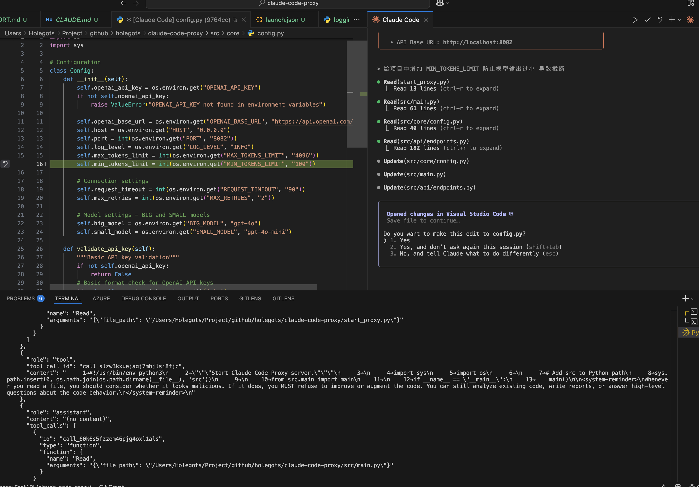

# Claude Code Proxy

A proxy server that enables **Claude Code** to work with OpenAI-compatible API providers. Convert Claude API requests to OpenAI API calls, allowing you to use various LLM providers through the Claude Code CLI.



## Features

- **Full Claude API Compatibility**: Complete `/v1/messages` endpoint support
- **Multiple Provider Support**: OpenAI, Azure OpenAI, local models (Ollama), and any OpenAI-compatible API
- **Smart Model Mapping**: Configure BIG and SMALL models via environment variables
- **Function Calling**: Complete tool use support with proper conversion
- **Boost-Directed Tool-Calling**: Enable tool usage with providers that disable the tools parameter
- **Iterative Refinement**: Up to 3-loop retry mechanism for complex tasks
- **Boost Caching & Pooling**: Reuses HTTP sessions and caches recent planning responses to cut latency
- **Streaming Responses**: Real-time SSE streaming support
- **Image Support**: Base64 encoded image input
- **Custom Headers**: Automatic injection of custom HTTP headers for API requests
- **Error Handling**: Comprehensive error handling and logging

## Quick Start

### 1. Install Dependencies

```bash
# Using UV (recommended)
uv sync

# Or using pip
pip install -r requirements.txt
```

### 2. Configure

```bash
cp .env.example .env
# Edit .env and add your API configuration
# Optional: Set BOOST_* variables if you want boost-directed tool-calling
# Note: Environment variables are automatically loaded from .env file
```

### 3. Start Server

```bash
# Direct run
python start_proxy.py

# Or with UV
uv run cc-boost

# Or with docker compose
docker compose up -d
```

### 4. Use with Claude Code

```bash
# If ANTHROPIC_API_KEY is not set in the proxy:
ANTHROPIC_BASE_URL=http://localhost:8082 ANTHROPIC_API_KEY="any-value" claude

# If ANTHROPIC_API_KEY is set in the proxy:
ANTHROPIC_BASE_URL=http://localhost:8082 ANTHROPIC_API_KEY="exact-matching-key" claude
```

## Configuration

The application automatically loads environment variables from a `.env` file in the project root using `python-dotenv`. You can also set environment variables directly in your shell.

### Environment Variables

**Required:**

- `OPENAI_API_KEY` - Your API key for the target provider

**Security:**

- `ANTHROPIC_API_KEY` - Expected Anthropic API key for client validation
  - If set, clients must provide this exact API key to access the proxy
  - If not set, any API key will be accepted

**Model Configuration:**

- `BIG_MODEL` - Model for Claude opus requests (default: `gpt-4o`)
- `MIDDLE_MODEL` - Model for Claude opus requests (default: `gpt-4o`)
- `SMALL_MODEL` - Model for Claude haiku requests (default: `gpt-4o-mini`)

**API Configuration:**

- `OPENAI_BASE_URL` - API base URL (default: `https://api.openai.com/v1`)

**Server Settings:**

- `HOST` - Server host (default: `0.0.0.0`)
- `PORT` - Server port (default: `8082`)
- `LOG_LEVEL` - Logging level (default: `WARNING`)

**Performance:**

- `MAX_TOKENS_LIMIT` - Token limit (default: `4096`)
- `REQUEST_TIMEOUT` - Request timeout in seconds (default: `90`)

**Boost Configuration (for tool-calling with providers that disable tools):**

- `ENABLE_BOOST_SUPPORT` - Enable boost for which tier (NONE, BIG_MODEL, MIDDLE_MODEL, SMALL_MODEL)
  - When enabled, uses a two-model approach: boost model plans, auxiliary model executes
- `BOOST_BASE_URL` - API endpoint for the boost model (required when boost is enabled)
- `BOOST_API_KEY` - API key for the boost model provider (required when boost is enabled)
- `BOOST_MODEL` - High-tier model for planning (default: gpt-4o)
- `BOOST_WRAPPER_TEMPLATE` - Custom template for boost model prompt (optional)

**Custom Headers:**

- `CUSTOM_HEADER_*` - Custom headers for API requests (e.g., `CUSTOM_HEADER_ACCEPT`, `CUSTOM_HEADER_AUTHORIZATION`)
  - Uncomment in `.env` file to enable custom headers

### Custom Headers Configuration

Add custom headers to your API requests by setting environment variables with the `CUSTOM_HEADER_` prefix:

```bash
# Uncomment to enable custom headers
# CUSTOM_HEADER_ACCEPT="application/jsonstream"
# CUSTOM_HEADER_CONTENT_TYPE="application/json"
# CUSTOM_HEADER_USER_AGENT="your-app/1.0.0"
# CUSTOM_HEADER_AUTHORIZATION="Bearer your-token"
# CUSTOM_HEADER_X_API_KEY="your-api-key"
# CUSTOM_HEADER_X_CLIENT_ID="your-client-id"
# CUSTOM_HEADER_X_CLIENT_VERSION="1.0.0"
# CUSTOM_HEADER_X_REQUEST_ID="unique-request-id"
# CUSTOM_HEADER_X_TRACE_ID="trace-123"
# CUSTOM_HEADER_X_SESSION_ID="session-456"
```

### Header Conversion Rules

Environment variables with the `CUSTOM_HEADER_` prefix are automatically converted to HTTP headers:

- Environment variable: `CUSTOM_HEADER_ACCEPT`
- HTTP Header: `ACCEPT`

- Environment variable: `CUSTOM_HEADER_X_API_KEY`
- HTTP Header: `X-API-KEY`

- Environment variable: `CUSTOM_HEADER_AUTHORIZATION`
- HTTP Header: `AUTHORIZATION`

### Supported Header Types

- **Content Type**: `ACCEPT`, `CONTENT-TYPE`
- **Authentication**: `AUTHORIZATION`, `X-API-KEY`
- **Client Identification**: `USER-AGENT`, `X-CLIENT-ID`, `X-CLIENT-VERSION`
- **Tracking**: `X-REQUEST-ID`, `X-TRACE-ID`, `X-SESSION-ID`

### Usage Example

```bash
# Basic configuration
OPENAI_API_KEY="sk-your-openai-api-key-here"
OPENAI_BASE_URL="https://api.openai.com/v1"

# Enable custom headers (uncomment as needed)
CUSTOM_HEADER_ACCEPT="application/jsonstream"
CUSTOM_HEADER_CONTENT_TYPE="application/json"
CUSTOM_HEADER_USER_AGENT="my-app/1.0.0"
CUSTOM_HEADER_AUTHORIZATION="Bearer my-token"
```

The proxy will automatically include these headers in all API requests to the target LLM provider.

### Boost-Directed Tool-Calling

The boost feature enables tool usage with providers that disable the `tools` parameter in their API. It uses a hybrid execution model with two stages:

1. **Planning Stage**: A high-tier boost model receives tool information embedded in the message content and provides guidance
2. **Execution Stage**: An auxiliary model receives the guidance and actual tools parameter to execute the operations

#### How It Works

```
User Request → Proxy Router
                ↓
         Check if boost enabled
                ↓
    [Boost Model] → Parse response
         ↓                   ↓
    SUMMARY?          GUIDANCE?
      ↓                   ↓
  Return to      [Auxiliary Model]
   user                ↓
                Execute tools
                ↓
            Return results
```

#### Response Formats

The boost model can respond in three formats:

1. **SUMMARY**: Direct answer when no tools are needed
2. **GUIDANCE**: Instructions for the auxiliary model (includes ANALYSIS and GUIDANCE sections)
3. **OTHER**: Invalid format triggers a retry (up to 3 attempts)

#### Configuration Example

```bash
# Enable boost for BIG_MODEL tier (e.g., Claude Opus requests)
ENABLE_BOOST_SUPPORT="BIG_MODEL"
BOOST_BASE_URL="https://api.openai.com/v1"
BOOST_API_KEY="sk-your-boost-api-key"
BOOST_MODEL="gpt-4o"

# Your regular configuration for the auxiliary model
OPENAI_API_KEY="sk-your-auxiliary-api-key"
OPENAI_BASE_URL="https://api.openai.com/v1"
BIG_MODEL="gpt-4o"
```

#### Use Cases

- **Providers without tool support**: Enable tool-calling with models that don't support the tools parameter
- **Complex reasoning tasks**: Use a high-tier model for planning while a smaller model executes
- **Cost optimization**: Reduce costs by using powerful models only for planning

### Model Mapping

The proxy maps Claude model requests to your configured models:

| Claude Request                 | Mapped To     | Environment Variable   |
| ------------------------------ | ------------- | ---------------------- |
| Models with "haiku"            | `SMALL_MODEL` | Default: `gpt-4o-mini` |
| Models with "sonnet"           | `MIDDLE_MODEL`| Default: `BIG_MODEL`   |
| Models with "opus"             | `BIG_MODEL`   | Default: `gpt-4o`      |

### Provider Examples

#### OpenAI

```bash
OPENAI_API_KEY="sk-your-openai-key"
OPENAI_BASE_URL="https://api.openai.com/v1"
BIG_MODEL="gpt-4o"
MIDDLE_MODEL="gpt-4o"
SMALL_MODEL="gpt-4o-mini"
```

#### Azure OpenAI

```bash
OPENAI_API_KEY="your-azure-key"
OPENAI_BASE_URL="https://your-resource.openai.azure.com/openai/deployments/your-deployment"
BIG_MODEL="gpt-4"
MIDDLE_MODEL="gpt-4"
SMALL_MODEL="gpt-35-turbo"
```

#### Local Models (Ollama)

```bash
OPENAI_API_KEY="dummy-key"  # Required but can be dummy
OPENAI_BASE_URL="http://localhost:11434/v1"
BIG_MODEL="llama3.1:70b"
MIDDLE_MODEL="llama3.1:70b"
SMALL_MODEL="llama3.1:8b"
```

#### Other Providers

Any OpenAI-compatible API can be used by setting the appropriate `OPENAI_BASE_URL`.

## Usage Examples

### Basic Chat

```python
import httpx

response = httpx.post(
    "http://localhost:8082/v1/messages",
    json={
        "model": "claude-3-5-sonnet-20241022",  # Maps to MIDDLE_MODEL
        "max_tokens": 100,
        "messages": [
            {"role": "user", "content": "Hello!"}
        ]
    }
)
```

## Integration with Claude Code

This proxy is designed to work seamlessly with Claude Code CLI:

```bash
# Start the proxy
python start_proxy.py

# Use Claude Code with the proxy
ANTHROPIC_BASE_URL=http://localhost:8082 claude

# Or set permanently
export ANTHROPIC_BASE_URL=http://localhost:8082
claude
```

## Testing

Run the full pytest suite (includes archived functional smoke flows):

```bash
uv run pytest tests

# Or only the archived functional scenarios
uv run pytest tests/archive
```

## Development

### Using UV

```bash
# Install dependencies
uv sync

# Run server
uv run cc-boost

# Format code
uv run black src/
uv run isort src/

# Type checking
uv run mypy src/
```

### Project Structure

```
cc-boost/
├── src/
│   ├── main.py                     # Main server entrypoint
│   ├── core/                       # Boost routing/orchestration logic
│   └── [other modules...]
├── start_proxy.py                  # Startup script
├── .env.example                    # Config template
├── tests/
│   ├── archive/                    # Completed functional flows
│   └── conftest.py                 # Shared fixtures/helpers
└── README.md                       # This file
```

## Performance

- **Async/await** for high concurrency
- **Connection pooling** for efficiency
- **Streaming support** for real-time responses
- **Configurable timeouts** and retries
- **Smart error handling** with detailed logging

## License

MIT License
