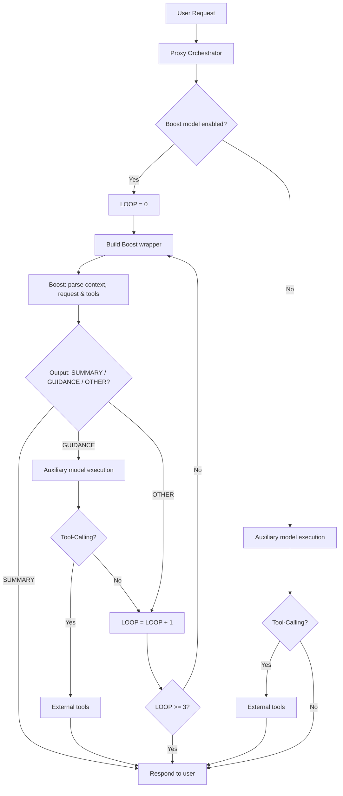

# Boost-Directed Tool-Calling Extension

## Overview
This proposal introduces a hybrid execution model that combines high-tier reasoning models with tool-capable models to enable powerful agentic behaviors even when providers disable the tools parameter. The system features an iterative refinement loop with up to 3 iterations to improve the quality of responses.

## Goals
1. Allow Boost models to understand available tools through message content
2. Provide structured guidance to auxiliary models for final execution
3. Preserve existing proxy features (streaming, error handling, model mapping)
4. Enable iterative refinement for complex multi-step tasks

## Flow Diagram



## Proposed Solution
A two-model approach with a wrapper format and iterative refinement:

### Boost Model Wrapper Format
The Boost model receives a specially formatted message that includes:

```
You are a boost model assisting an auxiliary model. Your response MUST follow ONE of these three formats:

FORMAT 1 - FINAL RESPONSE (when no tools needed):
SUMMARY:
[Provide the final answer directly without using auxiliary models]

FORMAT 2 - GUIDANCE FOR AUXILIARY MODEL (when tools needed):
ANALYSIS:
[Reasoning and understanding of the request context]

GUIDANCE:
[Instructions for the auxiliary model's tasks (include which tools to call)]

FORMAT 3 - OTHER (any other response will trigger a loop retry):
[Any response that doesn't match FORMAT 1 or 2]

---
Current ReAct Loop: [loop number, 0-2]
Previous Attempts: [if any, list previous responses that failed]

User Request: [original request]

Available Tools:
[tool definitions embedded as text, not as a tools parameter]
```

Key components:
- User's original request
- Available tools embedded in the message content (not in tools parameter)
- Current loop count (for iterative refinement)
- Previous failed attempts (for context)
- A structured response format with three possible outputs:
  1. **SUMMARY**: When tool-calling is unnecessary, respond with the final answer directly
  2. **GUIDANCE**: Instructions for the auxiliary model's tasks (include which tools to call and what operations to perform)
  3. **OTHER**: When the response doesn't match expected format, trigger loop increment

### Loop Mechanism
- The system maintains a LOOP counter starting at 0
- Loop triggers in two scenarios:
  1. Boost model response doesn't match expected format (neither SUMMARY nor GUIDANCE)
  2. Auxiliary model receives GUIDANCE but doesn't call any tools (no Tool-Calling field in response)
- After each trigger, LOOP is incremented and the system retries with refined context
- Maximum of 3 iterations (LOOP >= 3) before responding to user
- This allows the Boost model to refine its understanding and approach iteratively
- Smart detection ensures we only retry when the planned tool usage wasn't actually executed

### Auxiliary Model
Receives:
- Original user request
- Boost model's ANALYSIS and GUIDANCE sections
- Full tool definitions in the proper tools parameter
- Can actually execute the tools

Behavior:
- If tools are called (Tool-Calling field present): Execute tools and return results
- If no tools are called (no Tool-Calling field): Increment LOOP and retry with Boost model
- This retry mechanism ensures that when the auxiliary model ignores the GUIDANCE to use tools, the system can recover and try a different approach

### When Boost is Disabled
When Boost model is not enabled or not configured:
- Request goes directly to auxiliary model execution
- Standard tool-calling flow applies
- No loop mechanism is involved
- This maintains backward compatibility

## Key Features
- Tools information moved to message content for Boost model awareness
- Clear separation between planning (Boost) and execution (Auxiliary)
- Iterative refinement loop with up to 3 attempts for complex tasks
- Configurable model selection per request tier
- Seamless integration with existing Claude API interface
- Fallback to direct execution if boost model fails
- Smart detection of when auxiliary model actually uses tools
- Backward compatibility when boost is disabled

## Configuration
New environment variables:
- `BOOST_BASE_URL`: API endpoint for boost model
- `BOOST_API_KEY`: API key for boost model provider
- `BOOST_MODEL`: High-tier model for planning (no tools parameter needed)
- `ENABLE_BOOST_SUPPORT`: Which model tiers to enable for (NONE|BIG_MODEL|MIDDLE_MODEL|SMALL_MODEL)
- `BOOST_WRAPPER_TEMPLATE`: Optional custom template for boost model prompt (uses default if not provided)

## Impact
This change extends the proxy's capabilities by allowing high-tier models from providers that disable the tools parameter to understand and plan tool usage, while actual tool execution is handled by the auxiliary model.